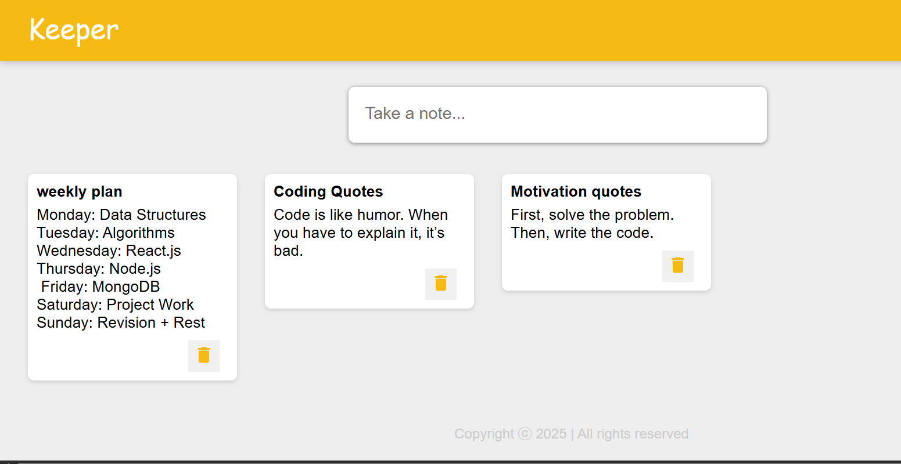

# 📝 Keeper App

A simple and intuitive note-taking web application built using **React.js**. Users can effortlessly create, view, and delete notes. All notes are stored locally in the browser using `localStorage`, ensuring data persistence even after refreshing the page.

---
## 🖥️ Live Demo


---

##  🚀 Features

- Create notes with a title and content.
- Expandable textarea input for a better writing experience
- Delete notes with a single click.
- Smooth add-button animation using Material UI.
- Data are saved using browser `localStorage`.

---

##  🛠️ Technologies Used

- React.js
- Material UI (`@mui/icons-material`, `@mui/material`)
- JavaScript (ES6+)
- HTML & CSS (custom styles)

---

##  📁 Project Structure

```
keeper-app/
├── public/
│   └── index.html
├── src/
│   ├── components/
|   |   |── App.js
│   │   ├── Header.jsx
│   │   ├── Footer.jsx
│   │   ├── Note.jsx
│   │   └── CreateArea.jsx
│   ├── index.js
│   └── styles.css
├── package.json
└── README.md
```

---

## 📸 UI Preview



---
## 📦 How to Run the Project

1. Clone the repository:

    `git clone https://github.com/your-username/keeper-app.git
    cd keeper-app`

2. Install dependencies:

    `npm install`

3. Start the development server:

    `npm start`

4. Open your browser and visit `http://localhost:3000`.

---

## 💡 Future Enhancements

- Add tags/categories for organizing notes
- Implement search and filter functionality
- Add dark/light theme toggle
- Support for pinning important notes

---

## 📌 License

Ths project is licensed under the MIT License.

---

## 🙌 Author

**Amrita Srivastava**  
Connect with me on 
[LinkedIn](https://www.linkedin.com/in/amrita-srivastava10/) | [GitHub](https://github.com/Amritasri10)


